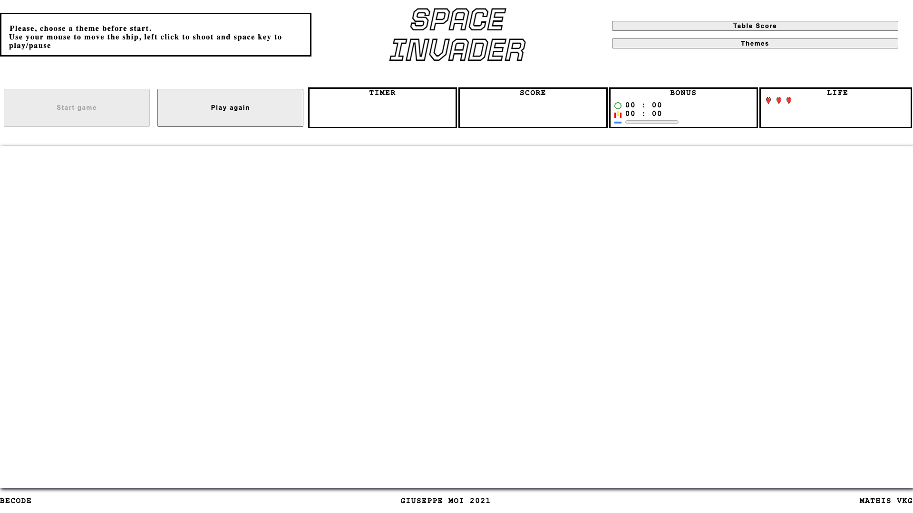
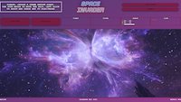
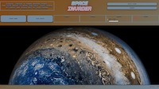
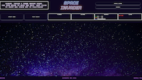

# PewPew

This is a small game based on a project made during my training at [BeCode](https://github.com/becodeorg/CRL-Keller-3.31/blob/master/LearningPath/02.The-Hill/08.Javascript/02.Season-2/2.Canvas/readme.md).  
I felt inspired and pushed the project as far as I could.

  

## How to play ?

- Go to this link [Space Invader](https://giuseppemoi.fun/).
- Choose a theme among the three proposed
- Click on start game
- Use your mouse to move left and right and left click on your mouse to shoot the targets
- You have 3 lifes to start and some more will appear during the game
- Keep an eye open to see the bonuses 
- This game has no end, just try to stay as long as you can
- When you lose, a name will be request and your score will be saved in a data base
- You can see the 10 best scores on a click on the table score button

___

## In play

1. ***Target***

    There is only one kind of target but they have different speeds.  
    They appear by wave of 10.  
    If a target touch your ship, you lose one life.

2. ***Bonuses***

    *There is 3 kind of bonusses*  

    You just have to get them with your ship when they appear.

     A shield that gives you 30 seconds of invulnerability  
     A triple laser for 30 seconds that assures you to touch the targets  
     A line that cleans the canvas of all targets

3. ***Life***

     Some heart will appear to give you more life 
___

## Credits

1. ***Ship, Target, Bonuses, Heart***

    All made with [Pixilart](https://www.pixilart.com/)

2. ***Song***

    Titre:  Shockwave  
    Auteur: Xivine  
    [Téléchargement gratuit](https://bit.ly/2JYtqfk)  
    [Musique proposée par Audio Libre](https://youtu.be/3obhnhC7oyE)

    Titre:  Bush Week  
    Auteur: Nihilore  
    [Source](https://nihilore.bandcamp.com)    
    [Licence](https://creativecommons.org/licenses/)  
    [Téléchargement (14MB)](https://auboutdufil.com/?id=521)  

    Titre:  Deflector  
    Auteur: Ghostrifter  
    [Source](http://ghostrifterofficial.bandcamp.com)    
    [Licence](https://creativecommons.org/licenses/)  
    [Téléchargement (3MB)](https://auboutdufil.com/?id=612)  

3. ***Sound effects***

    All made by myself.
